# Enterprise Sitemap Diagram

```mermaid
flowchart TD
  A[HOME]

  A --> B[About Us]
  B --> B1[Company Overview]
  B --> B2[Vision and Mission]
  B --> B3[Leadership]
  B --> B4[Compliance and Governance]

  A --> C[Services]
  C --> C1[Enterprise Software Development]
  C --> C2[Cloud and DevOps]
  C --> C3[Microservices Architecture]
  C --> C4[API and Integration Services]
  C --> C5[SaaS Development]
  C --> C6[Maintenance and AMC]

  A --> D[Solutions]
  D --> D1[Travel and Booking Systems]
  D --> D2[Fleet Management]
  D --> D3[Restaurant Management]
  D --> D4[HR and Manpower ERP]
  D --> D5[Educational ERP]
  D --> D6[Construction ERP]

  A --> E[Industries]
  E --> E1[Travel and Tourism]
  E --> E2[Construction]
  E --> E3[Education]
  E --> E4[Healthcare]
  E --> E5[IT Services]
  E --> E6[Government]

  A --> F[Technologies]
  F --> F1[Frontend]
  F --> F2[Backend]
  F --> F3[Cloud]
  F --> F4[DevOps]
  F --> F5[Messaging Systems]

  A --> G[Portfolio and Case Studies]

  A --> H[Global Presence]
  H --> H1[India Office]
  H --> H2[Saudi Operations]

  A --> I[Careers]
  A --> J[Insights and Blog]
  A --> K[Contact Us]
```

## Navigation Priority
1. Home
2. About Us
3. Services
4. Solutions
5. Industries
6. Technologies
7. Portfolio / Case Studies
8. Global Presence
9. Careers
10. Insights / Blog
11. Contact Us
